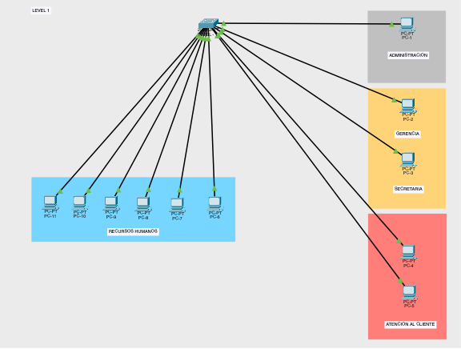
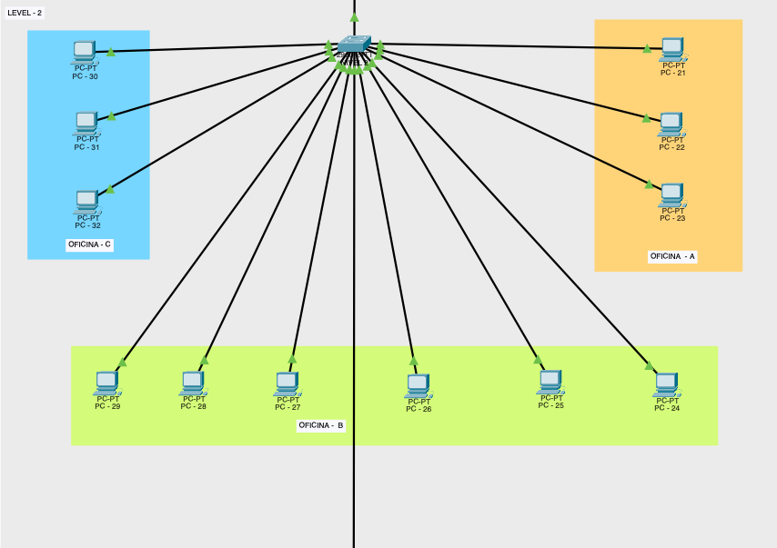
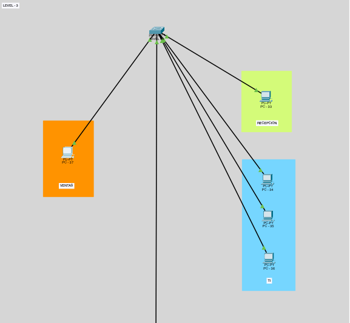
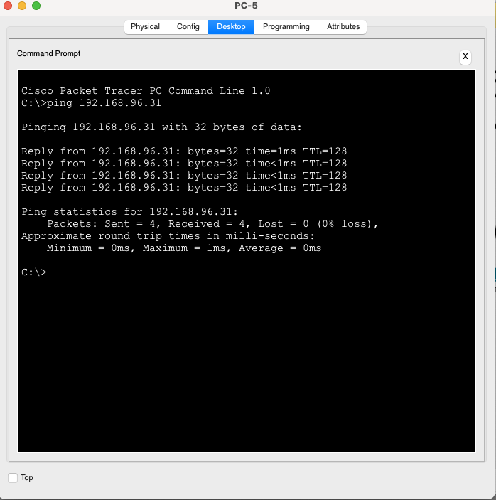
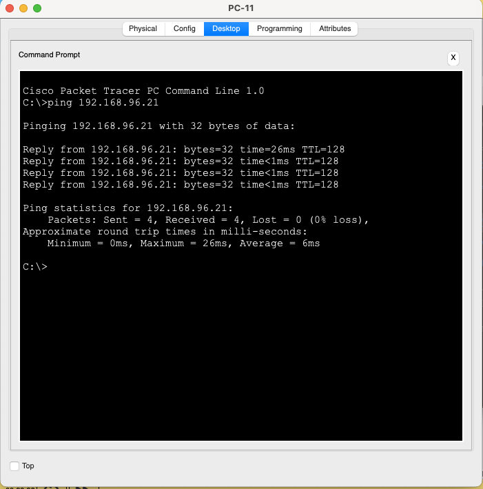
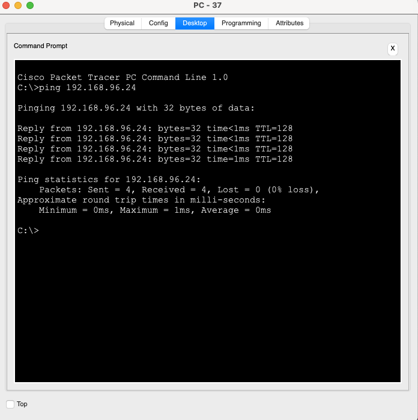
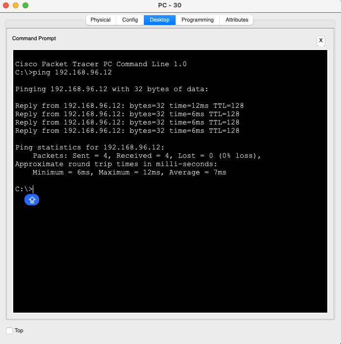
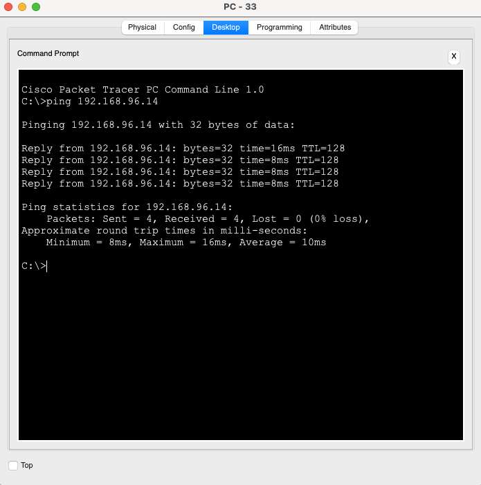
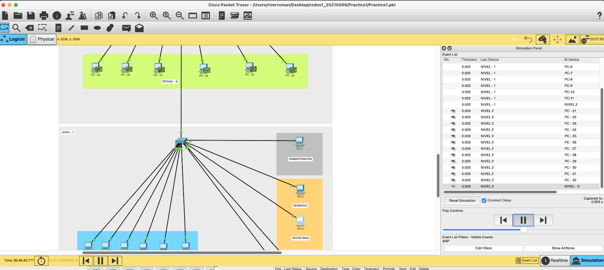
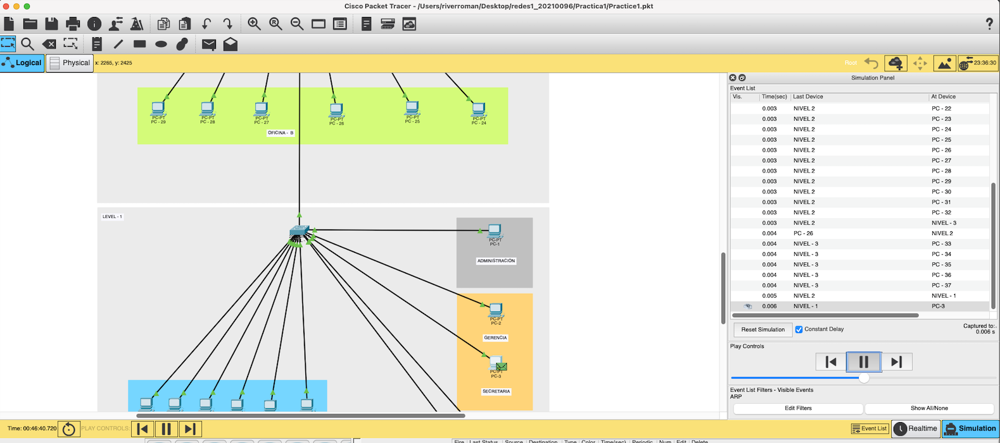

## PRACTICA 1
## UNIVERSIDAD DE SAN CARLOS DE GUATEMALA

---

|**CARNET**  |      **NOMBRE COMPLETO**          |  
|----------|:-----------------------------------:|
|202100096 |  RIVER ANDERSON - ISMALEJ ROMAN     |    
| AUXILIAR |            CARLOS QUIXTAN           |   
| SECCION  |                "A"                  |  

----

# Manual Tecnico 📌

----

## 1. Configuración VPCs

---

#### Nivel 1 - Administracion

| IPv4 Addres |      192.168.96.11         |  
|------------ |:--------------------------:|  

---

#### Nivel 1 - Gerencia y Secretaria

| IPv4 Addres |      192.168.96.13         |  
|------------ |:--------------------------:|  

---

#### Nivel 1 - Atencion al Cliente

| IPv4 Addres |      192.168.96.15         |  
|------------ |:--------------------------:|  

---

#### Nivel 1 - Recursos Humanos

| IPv4 Addres |      192.168.96.110        |  
|------------ |:--------------------------:|  

---

    
    
Nivel 1

---

#### Nivel 2 - Oficina A

| IPv4 Addres |      192.168.96.21         |  
|------------ |:--------------------------:|  

---

#### Nivel 2 - Oficina B

| IPv4 Addres |      192.168.96.24         |  
|------------ |:--------------------------:|  

---

#### Nivel 2 - Oficina C

| IPv4 Addres |      192.168.96.210        |  
|------------ |:--------------------------:|  

---

    
    
Nivel 2

---

#### Nivel 3 - Recepcion

| IPv4 Addres |      192.168.96.31         |  
|------------ |:--------------------------:|  

---

#### Nivel 3 - TI

| IPv4 Addres |      192.168.96.34         |  
|------------ |:--------------------------:|  

---

#### Nivel 3 - Ventas

| IPv4 Addres |      192.168.96.35         |  
|------------ |:--------------------------:|  

---

    
    
Nivel 3

---

## 2. Pings entre los hosts

---

    
1. Se realizó ping del computador PC-5 (Atencion al cliente) del nivel 1 al computador del Nivel 3 PC-1 (Recepcion).

    

---

    
2. Se realizó ping del computador PC-11 (Recursos Humanos) del nivel 1 al computador del Nivel 2 PC-21 (Oficina - A).

    

---

    
3. Se realizó ping del computador PC-37 (Ventas) del nivel 3 al computador del Nivel 2 PC-24 (Oficina - B).

    

---

    
4. Se realizó ping del computador PC-30 (Oficina C) del nivel 2 al computador del Nivel 1 PC-2 (Gerencia).

    

---

    
5. Se realizó ping del computador PC-33 (Recepcion) del nivel 3 al computador del Nivel 1 PC-4 (Atencion al Cliente).

    

---

## 3. Envio de Paquete ARP

---

    

    Para el envio de un paquete ARP si usará el modo simulacion que nos ofrece Cisco Packet Tracer.
    

    

    Se enviará un paquete del PC-3 (Secretaria) nivel 1 al PC-26 (Oficina B) nivel 2.
    

---

    
    

    Identificacion de la direcion MAC del destinatario.
    

    
    

    Envio exitoso del paquete a la direccion MAC identificada.
    

---

