

## PROYECTO 1
## UNIVERSIDAD DE SAN CARLOS DE GUATEMALA

---

|**CARNET**     |      **NOMBRE COMPLETO**          |  
|---------------|:-----------------------------------:|
|201020600      |  PEDRO ALEXANDER - SALAZAR          |
|202100096      |  RIVER ANDERSON - ISMALEJ ROMAN     |     
| **AUXILIAR**  |            CARLOS QUIXTAN           |   
| **SECCION**   |                "A"                  |  

----

# Manual Tecnico 📌

---

### Resumen de direccion IP  Y VLAN

##### **Centro Administrativo**

|**COMPUTADOR**     |      **IP COMPUTADOR**              |      **No. VLAN**   |
|---------------    |:-----------------------------------:|:--------------------|
| CONTABILIDAD2     |               192.168.26.2          |         26          |
| RRHH              |               192.168.46.2          |         46          |     
| SECRETARIA        |               192.168.36.1          |         36          |   
| IT_2              |               192.168.56.2          |         56          |

----

##### **Area Backbone**

|**COMPUTADOR**     |      **IP COMPUTADOR**              |      **No. VLAN**   |
|---------------    |:-----------------------------------:|:--------------------|
| S_IT              |               192.168.56.1          |         56          |
| S_CONTABILIDAD    |               192.168.26.1          |         26          |     
| S_RRHH            |               192.168.46.1          |         46          |   

----

##### **Area de Trabajo**

|**COMPUTADOR**     |      **IP COMPUTADOR**              |      **No. VLAN**   |
|---------------    |:-----------------------------------:|:--------------------|
| IT_1              |               192.168.56.3          |         56          |
| SECRETARIA_1      |               192.168.36.2          |         36          |     
| CONTABILIDAD_1    |               192.168.26.3          |         26          |   
| SECRETARIA_2      |               192.168.36.3          |         36          |
| RRHH1             |               192.168.46.3          |         46          |
| RRHH2             |               192.168.46.4          |         46          |

----

### Topologia

----

#### **Centro Administrativo** 

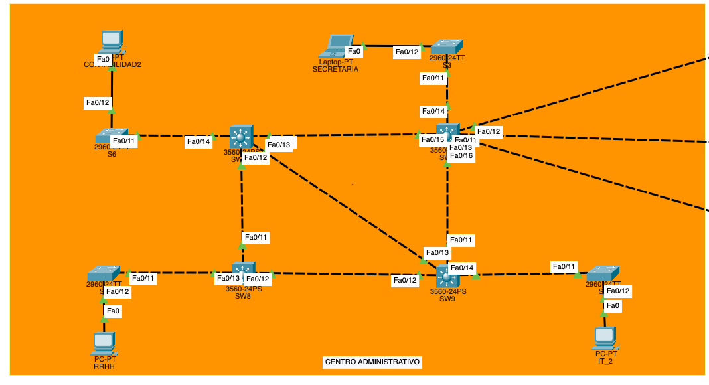

---

#### **Area Backbone**

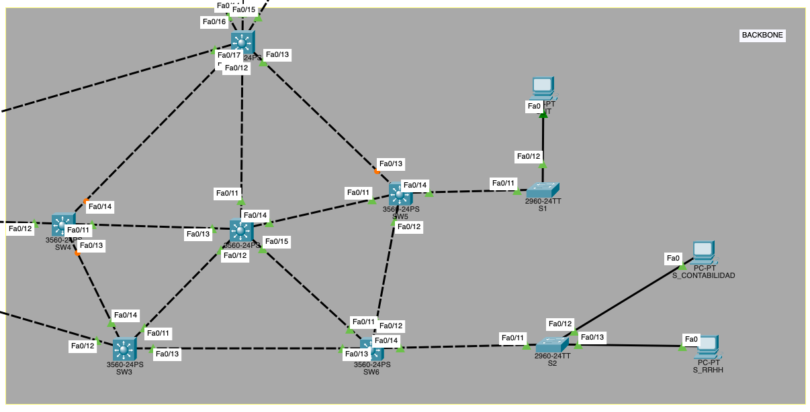

---

#### **Area de Trabajo**

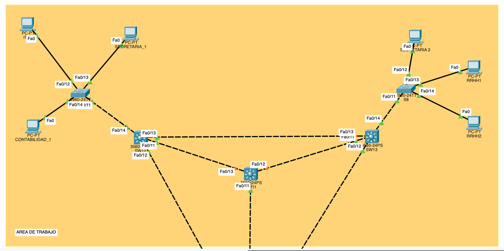

---

### Comandos Usados

    1. Comando para colocar el Switch: SW1 como servidor:

        enable
        configure terminal
        vtp mode server
        vtp domain P#20
        vtp password usac
        vtp version 2
        wr

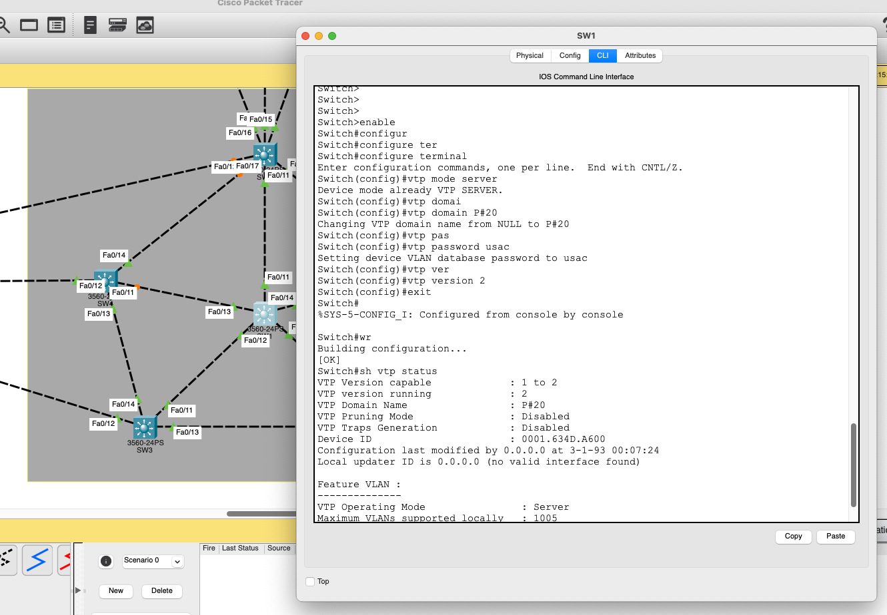

    2. Comando para colocar un switch en modo cliente:

        enable
        configure terminal
        vtp mode client
        vtp domain P#20
        vtp password usac
        wr

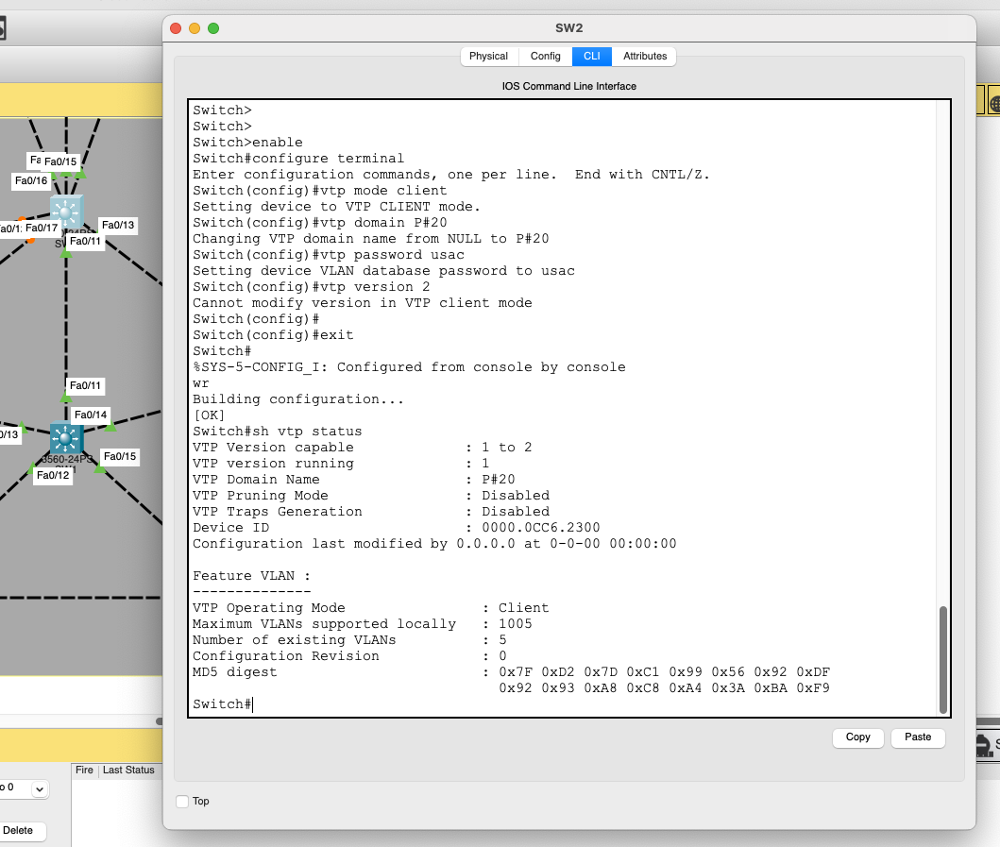

    3. Comando para configurar el switch: SW9 como transparente.

        enable
        configure terminal
        vtp mode transparent
        wr

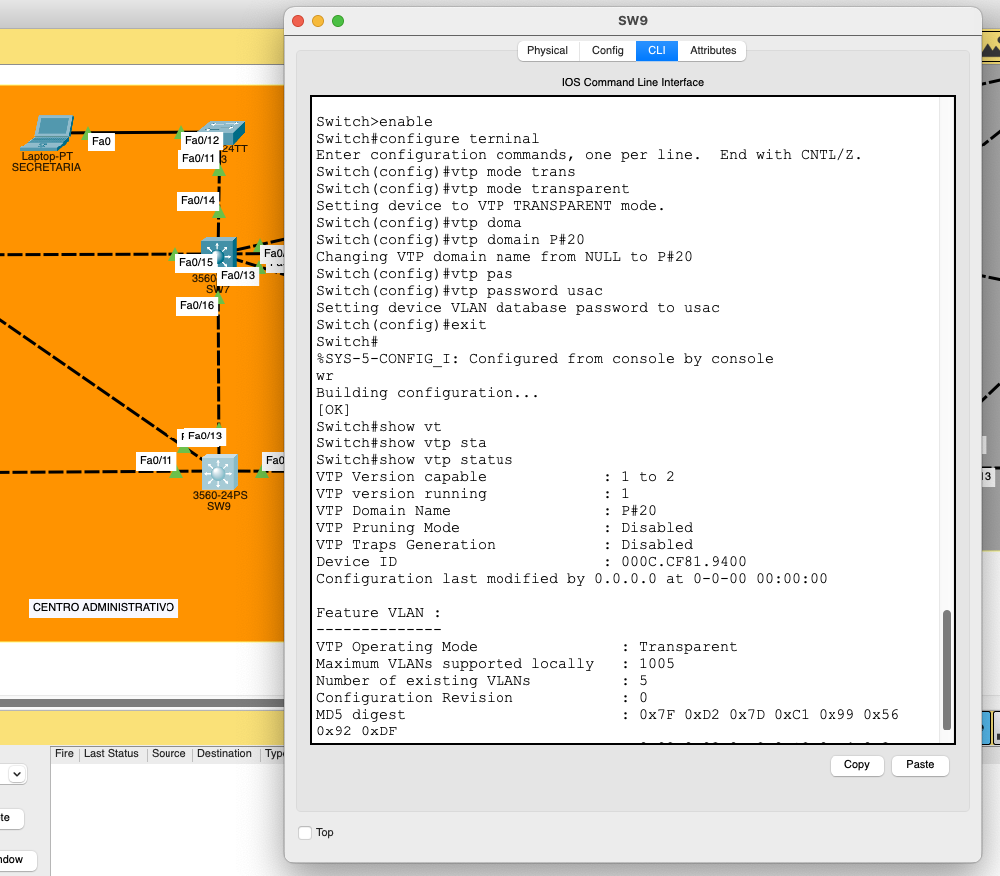 

    4. Comando para configurar el switch: SW1 como root (raiz).

        enable 
        configure terminal
        spannig-tree vlan 1 root primary
        wr

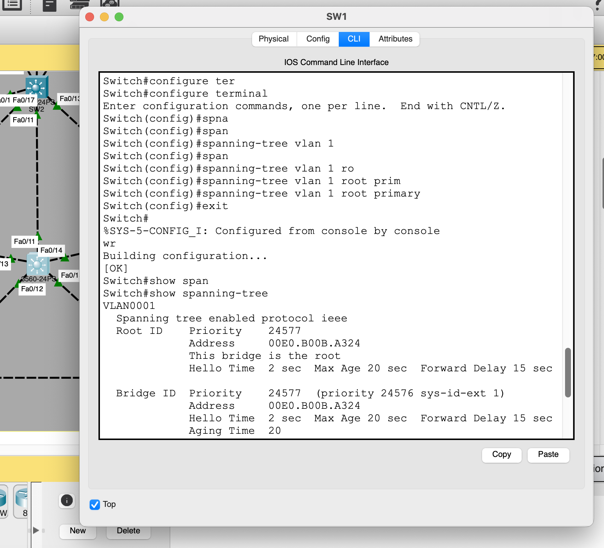   

    5. Comando para crear las vlans que seran distribuidas en los switches.

        enable 
        configure terminal 
        vlan 26
        name CONTABILIDAD
        exit
        vlan 36
        name SECRETARIA
        exit
        vlan 46
        name RRHH
        exit
        vlan 56
        name IT
        exit
        wr

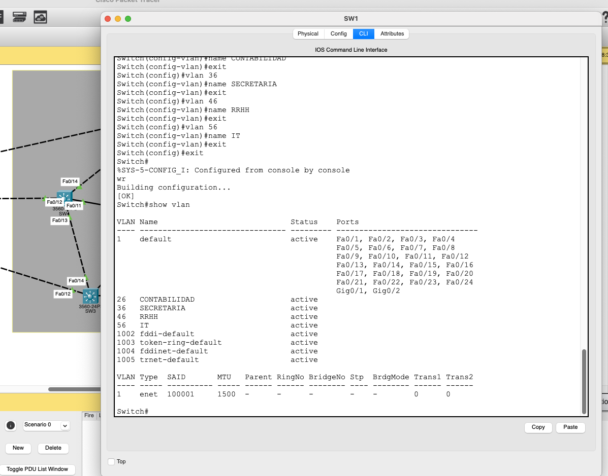

    6.  Comando para configurar el acceso a las vlans.

        enable 
        configure terminal
        interface **numero de interfaz a configurar**
        switchport mode access
        switchport access vlan **numero de vlan a configurar**
        no shutdown
        exit
        wr

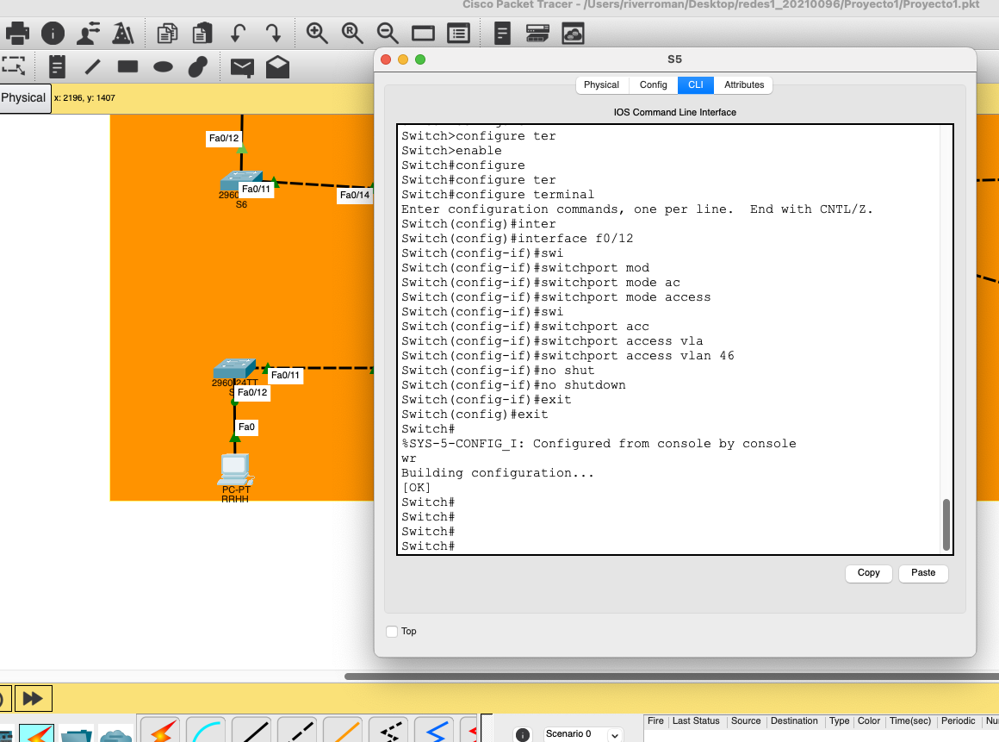  

    7.  Comado para configurar el RSTP-RAPID-PVST.

        enable
        configure terminal
        spanning-tree mode rapid-psvt
        exit
        wr

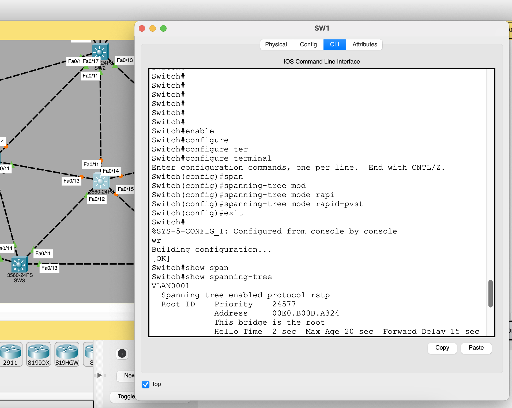    

---

### Ping entre hosts

    1. Se realizo ping del computador : S_IT al computador IT_2 con Ip: 192.168.56.2 el envio de paquete fue exitoso !.

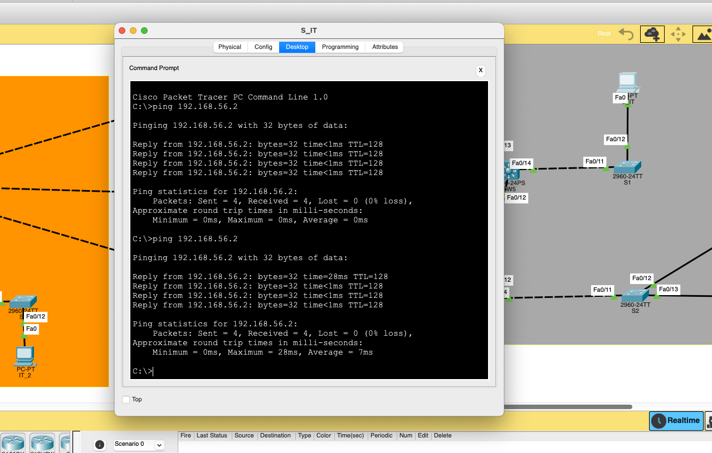 

----

    2. Se realizo ping del computador : CONTABILIDAD_1 al computador CONTABILIDAD 2 con IP: 192.168.26.2 el envio de paquete fue exitoso !.

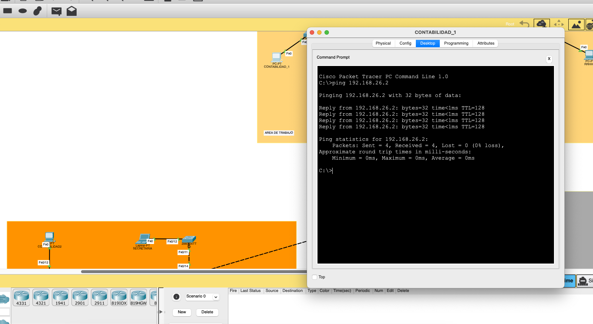 

----

